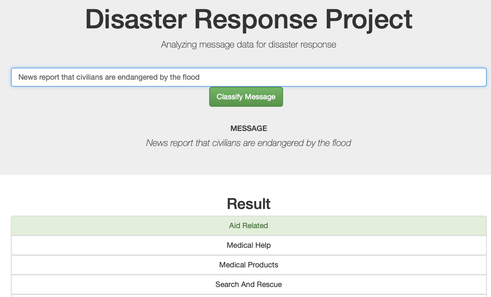

# Disaster Response Web-App
## by Caspar Heidbrink
***Disaster Response Pipeline Project in Course of Udacity's Data Scientist Nanodegree Programm***

### Motivation
In this project an ETL ("extract-transform-load") pipeline as well as a ML ("machine learning") pipeline is being build to train a model to categorize messages from the internet, if and how they are related to disasters like floods, riots etc. The trained model is then being used to be included in a web-app which allows entering a new message and obtaining the predictions regarding disaster related categories.  

The running app looks like the following:

This project is part of [Udacity](www.udacity.com)'s Data Science Nanodegree Programm whilst the underlying data has been provided by [Figure8](https://www.figure-eight.com/dataset/combined-disaster-response-data/).

### Instructions for execution
1. Run the following commands in the project's root directory to set up your database and model.

    - To run ETL pipeline that cleans data and stores in database
        `python data/process_data.py data/disaster_messages.csv data/disaster_categories.csv data/DisasterResponse.db`
    - To run ML pipeline that trains classifier and saves
        `python models/train_classifier.py data/DisasterResponse.db models/classifier.pkl`

2. Run the following command in the app's directory to run your web app.
    `python run.py`

3. Go to http://0.0.0.0:3001/

### Filestructure
- app
    - run.py  
      script using flask to provide plotly visualizations of training/test data and interactivity for entering text for further classification
    - templates
        - go.html
        - master.html
- data
    - disaster_categories.csv  
      contains uncleaned categorization of disaster messages
    - disaster_messages.csv   
      contains the uncleaned messages
    - process_data.py  
      script to clean data from csvs and save them to an sql database
    - DisasterResponse.db  
      sql database of the cleaned data
- models
    - train_classifier.py  
      script to process cleaned data (nlp-tasks using nlkt), build, train, test and save model (using sklearn, saving model.pkl)
    - model.pkl
      pickles trained model
- lab
  contains jupyter notebooks for initial exploration and structuring etl and ml tasks
- pics  
  contains screenshot

### Requirements
Requirements include pandas, nltk, scikit-learn and flask and are fully listed in requirements.txt and disaster_respond_pipeline.yml

### Link
https://github.com/QuantificAid/disaster_response_pipeline (for the review that funnyly could forck the repo but could not find it later ;-)
